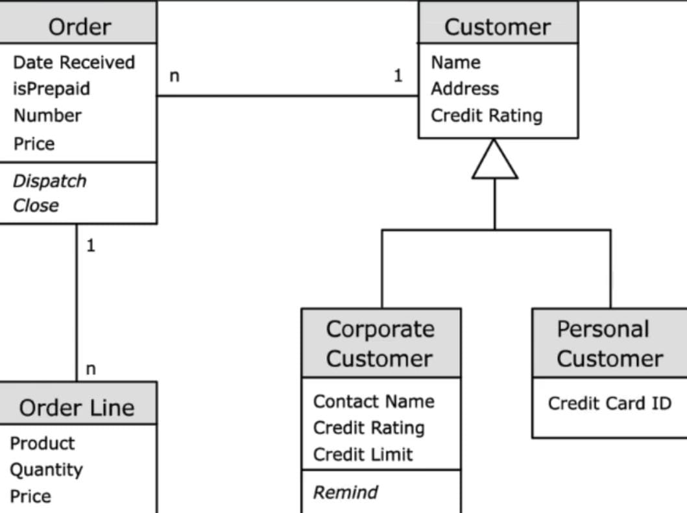

# **GitHub Copilot Vision - Prompt Reference**

A concise reference for using Copilot Vision with images and prompts for each topic.

---

## **Demo 1: Analyze Architecture Diagrams**

**Image as input:**  

**Prompts:**
- `Explain this architecture`
- `Explain Service Bus in detail`

---

## **Demo 2: Generate Class Files from Class Diagrams**

**Image as input:**  

**Prompts:**
- `Generate Java classes for the diagram attached`

---

## **Demo 3: Generate APIs and Models from Use Case Diagrams**

**Image as input:**  

**Prompts:**
- `generate Spring Boot api class for the diagram. Add models separately in different classes`

---

## **Demo 4: Data Modeling from ER Diagrams**

**Image as input:**  

**Prompts:**
- `generate sql create schema script for the er diagram`

---

## **Demo 5: Parse Network Topology to Generate Config Scripts**

**Image as input:**  

**Prompts:**
- `generate Terraform script for the diagram`

---

## **Demo 6: Screen Design to Frontend Code**

**Image as input:**  

**Prompts:**
- `Generate html, css scripts for this design`

---

## **Demo 7: Modify Existing Code Based on a Diagram**

**Image as input:**  

**Prompts:**
- `Modify the schema code based on the updtaed ER diagram`

---

## **Demo 8: Hand-Drawn Diagram to Code**

**Image as input:**  

**Prompts:**
- `Explain this Diagram`

---

## **Image-Based Code Generation Guide**

### **Step 2: Generating Code from Image Designs**

**Image as input:**  

**Prompts:**
- `Generate HTML, CSS, and JavaScript code for the attached login page design.`

---

**Image as input:**  

**Prompts:**
- `Generate HTML, CSS, and JavaScript code for the attached card design. Use placeholder images and maintain the color scheme.`

---

### **Step 3: Customizing Generated Code with Copilot**

**Prompts:**
- `Adjust the CSS to vertically center the main content and change button colors to orange.`
- `Make the title left-aligned and the menu items right-aligned.`
- `Replace the "Order" button with a link and center it.`

---