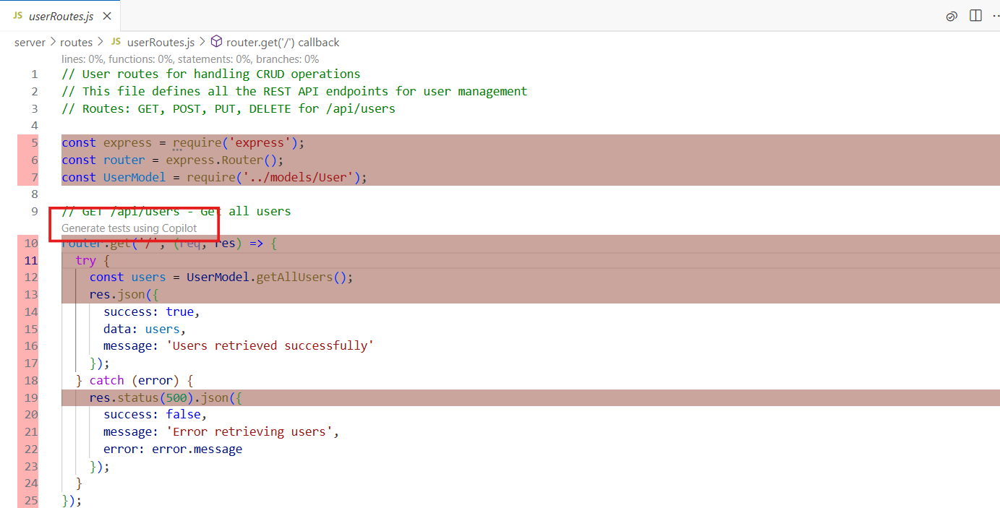

# Generating Test and Code Coverage Reports

This document outlines the process for generating test and code coverage reports for the MERN stack application. It includes details on running tests, viewing coverage reports, and understanding the test results.

## Prompt to Generate Unit Tests

To generate unit tests for the MERN stack application, you can use the following prompt on github Copilot:

```text
Write unit test cases for the User class from the MERN application using a test framework like Jest.

Requirements:

Test all CRUD methods for User.js
Include edge cases:
Missing required fields (e.g., name or email)
Invalid email format
Duplicate email on create
Update or delete non-existent user
Use in-memory storage for isolation
Add clear comments explaining what each test case does
Output the result as a single file named: User.test.js
```

The prompt will help you generate comprehensive unit tests for the User class, ensuring that all CRUD operations are covered and edge cases are handled.

## Running Tests

To run the tests on Jest using github Copilot through prompt:

```plain
Check the user.test.js for any errors. If errors exist, fix them. Then, 
install any required packages (e.g., using npm install) to ensure the project
runs successfully. Finally, run and execute the test cases (using npm test
or Jest). Provide the output and confirm if all tests pass.
```

The above prompt will guide you through checking for errors, installing necessary packages, and running the tests to ensure everything is functioning correctly.

## Test Explorer UI

To view the test results or run tests using the Test Explorer UI in your IDE, follow these steps:

1. Open your IDE (e.g., Visual Studio Code).
2. Install the Test Explorer UI extension from the marketplace.

  

3. And also install Jest provided by Orta extension.

  

4. Ensure your project is set up with Jest and the test files are correctly named (e.g., `*.test.js`).
5. Open the Test Explorer panel.
6. You should see the list of tests available in your project.


## Enable Code Coverage

To enable code coverage, use the following prompt with GitHub Copilot:

```text
Configure Jest to collect code coverage for the MERN application.
Update the Jest configuration to enable coverage reporting for all the files.
Run the tests and display the coverage report in the terminal.
configure settings.json to enable code coverage and show coverage on jest load and use colors and check all the code on Test Explorer UI.
```

This setup will allow you to see code coverage reports directly in your terminal and within the Test Explorer UI.

## Enable Generate Test Code Lens

Below are the steps to enable the "Generate Test Code Lens" feature in your IDE:

1. Open your IDE (e.g., Visual Studio Code).
2. Go to the settings (File > Preferences > Settings) or use the shortcut (Ctrl + , or Cmd + ,).
3. Search for "`github.copilot.chat.generateTests.codeLens`".
4. Enable the "`Generate Test Code Lens`" option.
5. Save the settings.(using Ctrl + S or Cmd + S)


## Rerun the Code Coverage

1. Open the Test Explorer UI in your IDE.
2. Click on the "Run with Test Coverage" button.


3. This will execute the tests and generate a coverage report.
4. Now if you navigate to the `.js` file you want to check the coverage for, you will see the coverage information highlighted in the editor and the `Generate tests using copilot` code lens will be available.



5. Click on the `Generate tests with copilot` code lens to generate tests for the file.

## Conclusion

This document provides a comprehensive guide to generating and running tests, viewing code coverage, and utilizing the Test Explorer UI in a MERN stack application. By following the steps outlined, you can ensure that your application is well-tested and maintainable, with clear visibility into test results and code coverage metrics.