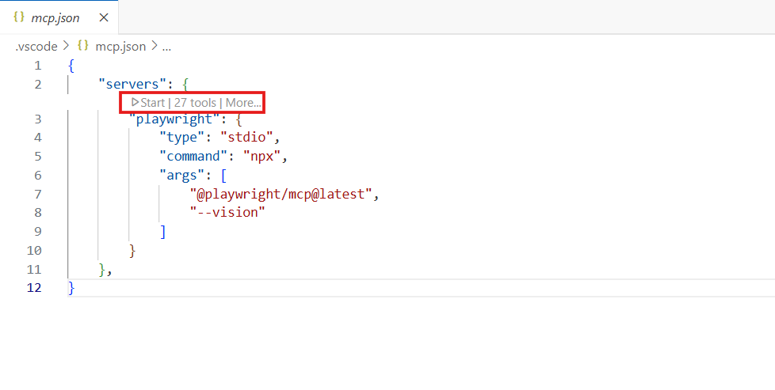

# Playwright MCP Server

This repository contains the Playwright MCP Server, which is used to run tests and manage code coverage for the Playwright framework.

## Install Playwright

To install Playwright, run the following command in your terminal:

```bash
npx playwright install
```

## Configure MCP Server

To configure the MCP server, you need to set up the necessary environment variables and configurations. This typically involves specifying the path to your Playwright tests and any other required settings.

1. Create a `.vscode` directory in the root of your project if it doesn't exist.
2. Inside the `.vscode` directory, create a `mcp.json` file with the following content:

```json
{
    "servers": {
        "playwright": {
            "type": "stdio",
            "command": "npx",
            "args": [
                "@playwright/mcp@latest",
                "--vision"
            ]
        }
    },
}
```

3. save the file.

4. Start the MCP server by clicking on the **start** button shown in the `mcp.json` file in Visual Studio Code.



---

## Create Playwright Tests using GitHub Copilot

To create Playwright tests using GitHub Copilot, follow these steps:

**Prompt**

```text
install and configure playwright and create a ui test script navigating to http://localhost:3000 and push Add New User button and add the scripts to my repo Type Name Vijay into name field type Email vijay.nvb@gmail.com into email field type password 123456 into password field Push Create User Button. Verify Alert showing User created successfully!. and run the test and verify
```

This prompt will guide GitHub Copilot to generate a Playwright test script that navigates to the specified URL, fills in the form fields, and verifies the success alert.

## Create Automated Tests using GitHub Copilot

To create automated tests using GitHub Copilot, you can follow a similar approach. Provide a detailed prompt that describes the test scenario you want to automate, including the steps to reproduce the issue and the expected outcome.

**Prompt**

```text
create a ui automation test using existing name ,email and password and take the final test results screenshot in client/test-results folder
```

This prompt will help GitHub Copilot generate a test script that automates the specified scenario, including taking a screenshot of the final test results.

---